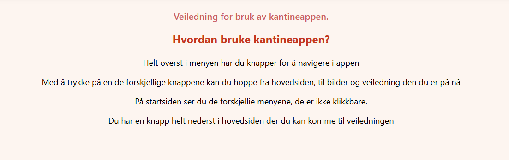
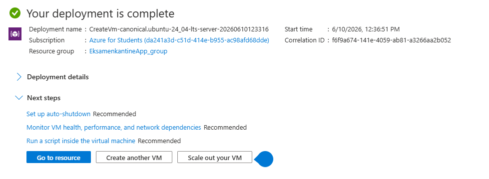
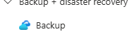
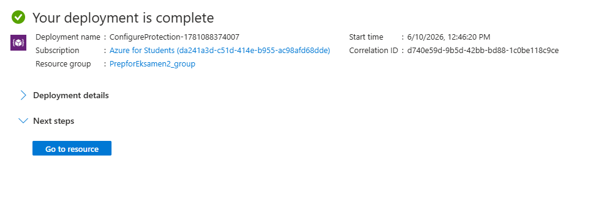
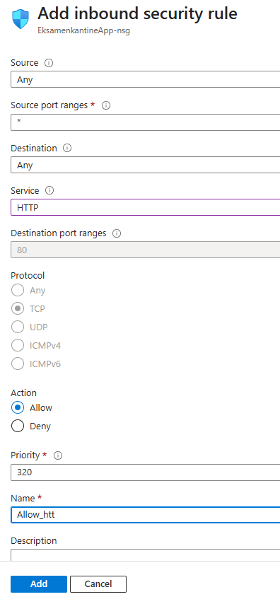

## Dokumentasjon på viderutvikling på **nettsiden**

Jeg laget en veiledning for brukeren på hvordan du bruker nettsiden 

Jeg startet med å beskrive hvordan nettsiden fungerer 

* Om menyene er klikkbare.
* hvordan du navigerer gjennom nettsiden.
* Hva er inpå de forskjellige sidene.

## Azure Oppsett

Jeg Lager en vm på **Microsoft azure** der jeg skal hoste kantine appen min.

* Ubunto som operativsystem 
* Disk på **17 dollar** i timen 

Nå skal jeg sette up backup

Da er backup ferdig

På nettwork settings på jeg tilate port 80http. **Det gjør at den setter til inbound security rule.**

* På service valgte jeg HTTP som er 80
* Og jeg måtte gi den ett navn på rule.
* Så addet jeg regelen på networking

Dette gjør at folk kan komme inpå nettsiden min. 

Nå ssh jeg inn i vm via terminal 
jeg cd inn i downloads mappen

Jeg begynner med å update vm 

* Sudo apt update
* Sudo apt upgrade

Disse komandoene sørger for at maskinen er up tp date slik at jeg ikke kjører på en uopdatert vm 

Jeg bruker docker til å hoste appen så da må jeg laste ned docker på vm. Det gjør jeg enkelt med å paste inn dette i terminalen

* curl -sSL https://gist.githubusercontent.com/Valhallabooi/d00c9f168f5a2d4e6fd769af5f07cdb3/raw/1527c0509a3321e3316107202e57a170ec1d8697/install_docker.sh | bash

Github clone

**For at vm skal vite hvor appen min ligger og hva den skal hente ut så kloner jeg hele github repo.**

Slik:

* git clone Kantineappen-til-Patryk.git

ls for å se hva mapper som ligger der

cd for å komme seg inn i mappen. 

Så lager jeg en docker-compose fil, det gjør du slik:

* nano docker-compose.yml

Så bygger vi containere. det gjør vi med å skrive inn.

* sudo docker compose up -d --build
